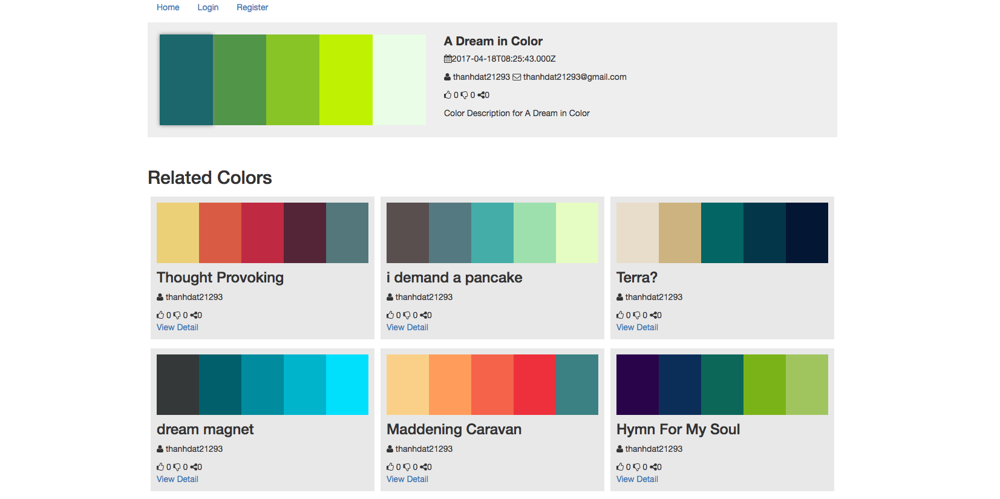

# Dự án Color Pro

### Cài đặt
```
git clone https://github.com/thanhdat21293/color.git
npm i
cd color/
```

### Cấu hình kết nối CSDL
```
config/config.json
```

### Chạy thử
```
node index.js
```

### Những chức năng đã làm
1. Hiển thị tất cả Pallet, có phân trang
2. Search theo tên, lọc theo like, mới nhất.
3. Copy mã màu
4. Người dùng đăng ký
5. Hiển thị Pallet liên quan theo màu.(Người dùng click 1 màu -> tìm 10 màu gần giống -> tìm bộ màu mà có 10 màu gần giống -> lấy ra 12 bộ màu)

### Những chức năng chưa làm
1. Login (nên dùng jwt)
2. Người dùng thêm các Pallet
3. Like, dislike, share
4. Giao diện

### 1 số vấn đề cẩn fix
1. CSDL chưa được tối ưu
- Bảng CSDL cũ: (Không tối ưu người dùng, hiện tại đang dùng)
    ```
    COLLECTION: id,name,color1,color2,color3,color4,color5,id_user,date,description,share
    USERS: id,username,email,password,date
    LIKE_DISLIKE: id_collection,id_user,status,date
    RELATED: id,id_related,score
    ```
- Giải thích:
    + COLLECTION: 
    ```
    id: Tự sinh, dùng shortid
    name: tên bộ màu
    color1 -> color5: Màu (Định hàng hex. Ví dụ: FFF000)
    id_user: Id người dùng tạo
    share: Đếm số lượt chia sẻ
    ```
    + LIKE_DISLIKE: 
    ```
    id_collection: Màu (Định dạng: hex)
    status: trạng thái (Định dạng: like/dislike)
    ```
    + RELATED:
    ```
    id: Mã màu
    id_related: mã màu
    score: Khoảng cách giữa màu id và màu id_related, càng nhỏ thì càng giống nhau. 
    ```

- Bảng CSDL mới: (Tối ưu hơn CSDL cũ, nên xem xét để làm)
    ```
    PALLET: id,name,id_user,date,description,share
    PALLET_COLOR: pallet_id,color_id
    COLOR: id
    USERS: id,username,email,password,date
    LIKE_DISLIKE: id_collection,id_user,status,date
    RELATED: id,id_related,score
    ```
- Giải thích:
    + PALLET đổi tên từ COLLECTION
    + COLOR: id (id mà mã màu, định dạng: hex)


### Ảnh website
- Trang chủ


- Trang chi tiết

